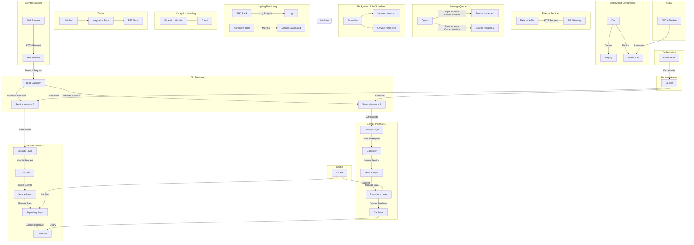

```mermaid
graph TD
  subgraph "Client (Frontend)"
    A[Web Browser] -->|HTTP Request| B[API Gateway]
  end

  subgraph "API Gateway"
    B -->|Forward Request| C[Load Balancer]
    C -->|Distribute Request| D[Service Instance 1]
    C -->|Distribute Request| E[Service Instance 2]
  end

  subgraph "Service Instance 1"
    D -->|Authenticate| F[Security Layer]
    F -->|Handle Request| G[Controller]
    G -->|Invoke Service| H[Service Layer]
    H -->|Manage Data| I[Repository Layer]
    I -->|Access Database| J[Database]
  end

  subgraph "Service Instance 2"
    E -->|Authenticate| K[Security Layer]
    K -->|Handle Request| L[Controller]
    L -->|Invoke Service| M[Service Layer]
    M -->|Manage Data| N[Repository Layer]
    N -->|Access Database| O[Database]
  end

  subgraph "External Services"
    P[External APIs] -->|HTTP Request| Q[API Gateway]
  end

  subgraph "Message Queue"
    R[Queue] -->|Asynchronous Communication| S[Service Instance 1]
    R -->|Asynchronous Communication| T[Service Instance 2]
  end

  subgraph "Background Jobs/Schedulers"
    U[Scheduler] --> V[Service Instance 1]
    U --> W[Service Instance 2]
  end

  subgraph "Database"
    J -->|Query| O
  end

  subgraph "Cache"
    X[Cache] -->|Caching| I
    X -->|Caching| N
  end

  subgraph "Logging/Monitoring"
    Y[ELK Stack] -->|Log Analysis| Z[Logs]
    AA[Monitoring Tools] -->|Metrics| AB[Metrics Dashboard]
  end

  subgraph "Exception Handling"
    AC[Exception Handler] --> AD[Client]
  end

  subgraph "Testing"
    AE[Unit Tests] --> AF[Integration Tests]
    AF --> AG[E2E Tests]
  end

  subgraph "Deployment Environment"
    AH[Dev] -->|Deploy| DI[Staging]
    AH -->|Deploy| DJ[Production]
  end

  subgraph "Containerization"
    DK[Docker] -->|Container| D
    DK -->|Container| E
  end

  subgraph "Orchestration"
    DL[Kubernetes] -->|Orchestrate| DK
  end

  subgraph "CI/CD"
    DM[CI/CD Pipeline] -->|Automate| DJ
  end
```