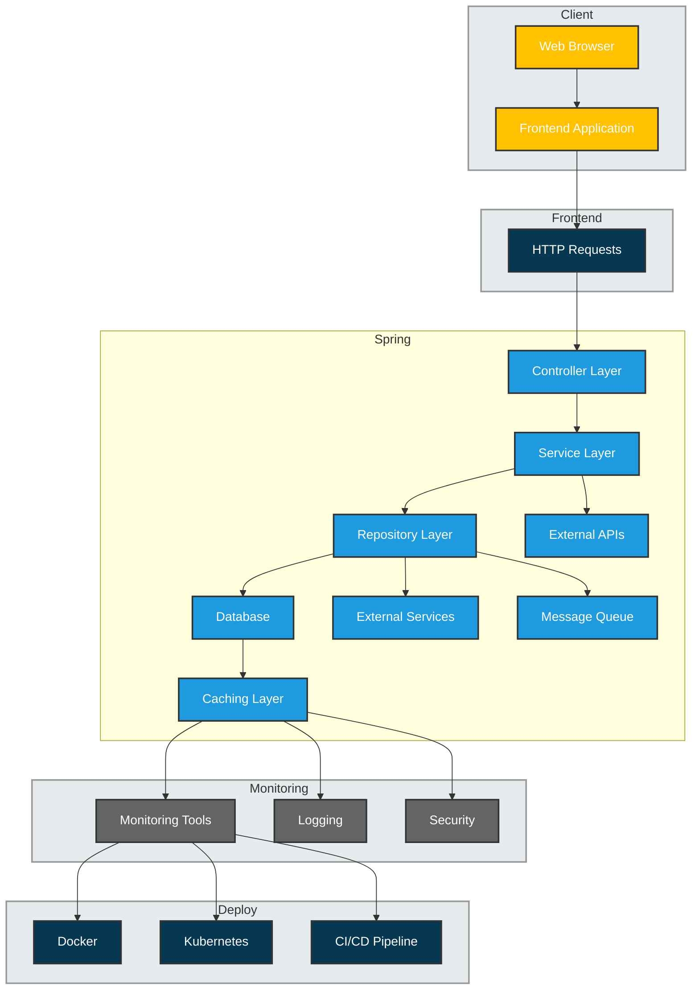

```mermaid
%%{init: {"theme": "default"}}%%
graph TD;
    classDef clientNode fill:#ffc100,stroke:#333,stroke-width:2px,color:white;
    classDef frontendNode fill:#063852,stroke:#333,stroke-width:2px,color:white;
    classDef springNode fill:#1e9adf,stroke:#333,stroke-width:2px,color:white;
    classDef monitoringNode fill:#636466,stroke:#333,stroke-width:2px,color:white;
    classDef deploymentNode fill:#063852,stroke:#333,stroke-width:2px,color:white;

    style Client fill:#e6ebed,stroke:#999,stroke-width:2px;
    style Frontend fill:#e6ebed,stroke:#999,stroke-width:2px;
    style Spring fill:#e6ebed,stroke:#999,stroke-width:2px;
    style Monitoring fill:#e6ebed,stroke:#999,stroke-width:2px;
    style Deploy fill:#e6ebed,stroke:#999,stroke-width:2px;

    subgraph Client
        A[Web Browser] --> B[Frontend Application]
        class A,B clientNode;
    end
    subgraph Frontend
        B --> C[HTTP Requests]
        class C frontendNode;
    end
    subgraph Spring
        C --> D[Controller Layer]
        D --> E[Service Layer]
        E --> F[Repository Layer]
        F --> G[Database]
        class D,E,F,G springNode;
    end
    subgraph Spring
        G --> H[Caching Layer]
        class H springNode;
    end
    subgraph Spring
        F --> I[External Services]
        class I springNode;
    end
    subgraph Spring
        F --> J[Message Queue]
        class J springNode;
    end
    subgraph Spring
        E --> K[External APIs]
        class K springNode;
    end
    subgraph Monitoring
        H --> L[Monitoring Tools]
        H --> M[Logging]
        H --> N[Security]
        class L,M,N monitoringNode;
    end
    subgraph Deploy
        L --> O[Docker]
        L --> P[Kubernetes]
        L --> Q[CI/CD Pipeline]
        class O,P,Q deploymentNode;
    end
```
