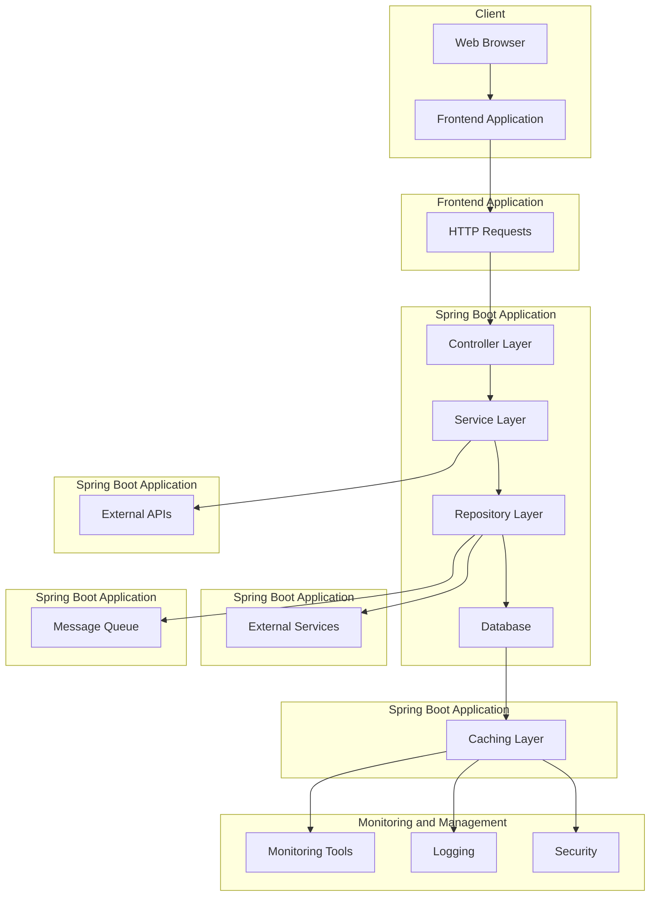

```mermaid
graph TD;

    subgraph "Client" 
        A[Web Browser] --> B[Frontend Application]
    end

    subgraph "Frontend Application"
        B --> C[HTTP Requests]
    end

    subgraph "Spring Boot Application"
        C --> D[Controller Layer]
        D --> E[Service Layer]
        E --> F[Repository Layer]
        F --> G[Database]
    end

    subgraph "Spring Boot Application"
        G --> H[Caching Layer]
    end

    subgraph "Spring Boot Application"
        F --> I[External Services]
    end

    subgraph "Spring Boot Application"
        F --> J[Message Queue]
    end

    subgraph "Spring Boot Application"
        E --> K[External APIs]
    end

    subgraph "Monitoring and Management"
        H --> L[Monitoring Tools]
        H --> M[Logging]
        H --> N[Security]
    end
```
    subgraph "Deployment"
        L --> O[Docker]
        L --> P[Kubernetes]
        L --> Q[CI/CD Pipeline]
    end
